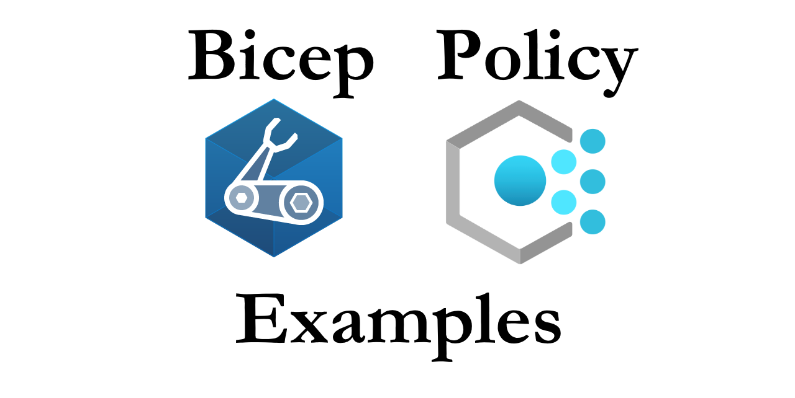

[](https://github.com/globalbao/bicep-policy-examples/actions/workflows/Bicep-CI.yml) [](https://github.com/globalbao/bicep-policy-examples/actions/workflows/Bicep-CD.yml)

Collection of Azure Policy examples using Bicep :muscle: by @jesseloudon
> *Bicep + Policy icons are from Microsoft*

Get in touch :octocat:

* Twitter: [@coder_au](https://twitter.com/coder_au)
* LinkedIn: [@JesseLoudon](https://www.linkedin.com/in/jesseloudon/)
* Web: [jloudon.com](https://jloudon.com)
* GitHub: [@JesseLoudon](https://github.com/jesseloudon)

Learning resources :books:
* [https://github.com/Azure/bicep](https://github.com/Azure/bicep)
* [https://docs.microsoft.com/en-us/azure/governance/policy/overview](https://docs.microsoft.com/en-us/azure/governance/policy/overview)

## Blogs that might interest you :pencil:

* [Azure Spring Clean: DINE to Automate your Monitoring Governance with Azure Monitor Metric Alerts](https://jloudon.com/cloud/Azure-Spring-Clean-DINE-to-Automate-your-Monitoring-Governance-with-Azure-Monitor-Metric-Alerts/)


### Authored & Tested with

* [azure-cli](https://docs.microsoft.com/en-us/cli/azure/install-azure-cli) version 2.20.0
* bicep cli version 0.3.255 (589f0375df)
* [bicep](https://marketplace.visualstudio.com/items?itemName=ms-azuretools.vscode-bicep) 0.3.1 vscode extension

### Example Deployment Steps

```
# optional step to view the JSON/ARM template
az bicep build -f ./main.bicep

# required steps
az login
az deployment sub create -f ./main.bicep -l australiaeast

# optional step to trigger a subscription-level policy compliance scan 
az policy state trigger-scan
```

> Note: Bicep role assignments for new service principals (SP) created by policy assignments will sometimes fail to find the new SP upon 1st run (even though a dependency exists between the resources). This role assignment failure will not reoccur upon a 2nd run of the main.bicep file.
